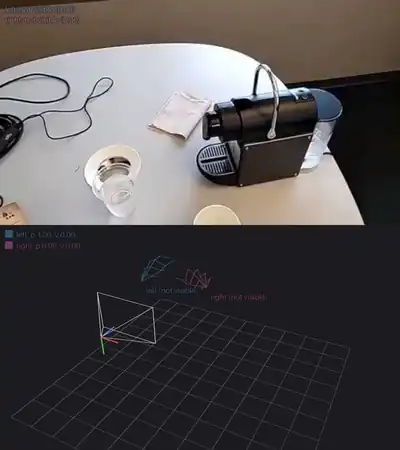
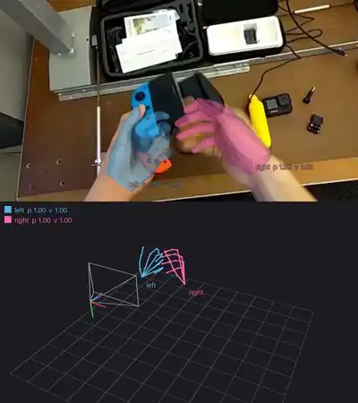
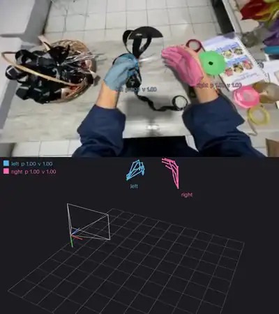
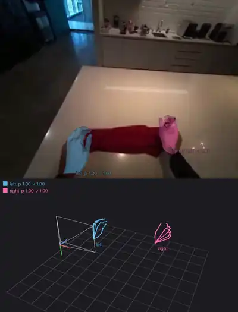
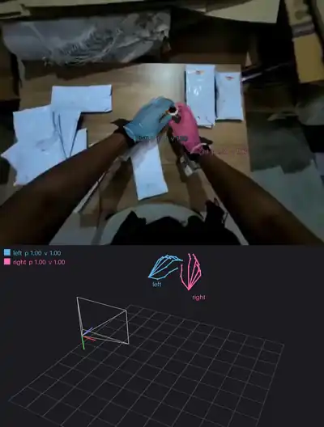
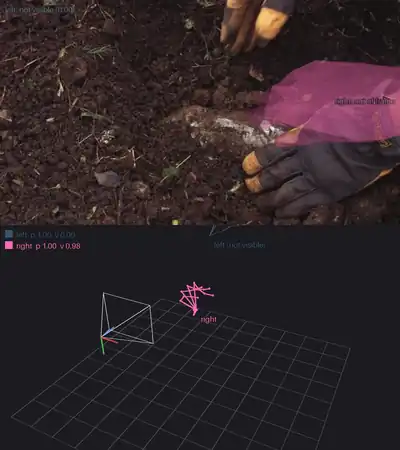
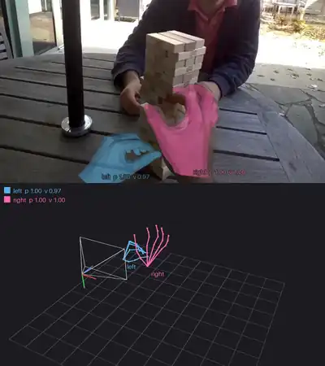
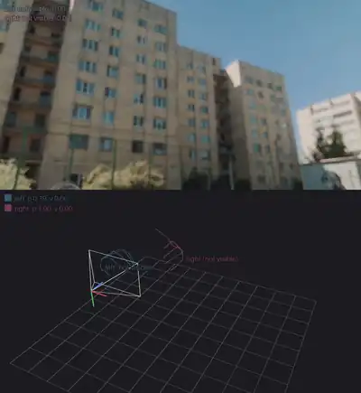
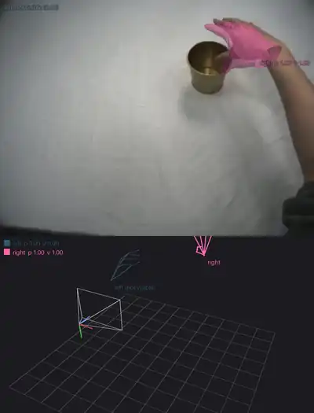

# ACE-Ego-Hand Pipeline

Bimanual 3D hand motion from egocentric video: MANO pose, shape and camera-space translation
for every frame, through occlusion and out-of-view gaps; a hand detector only vets `visible`.

This repository is a fork-style inference reimplementation of
[ACE-Ego-Hand](https://github.com/ggxxii/ACE-Ego-Hand) (Liu et al., 2026,
[arXiv:2608.20308](https://arxiv.org/abs/2608.20308), [project page](https://ggxxii.github.io/ace-ego-hand/)).
The model and the released weights are theirs. What changed here:

- the Wan2.2-5B backbone, its VAE encoder and MANO are written from scratch in plain PyTorch:
  no `diffusers`, `transformers`, `peft`, `smplx`, `omegaconf` or OpenCV;
- the weights are repackaged as safetensors at
  [blanchon/ACE-Ego-Hand-Safetensors](https://huggingface.co/blanchon/ACE-Ego-Hand-Safetensors),
  pruned to the 16 transformer blocks that run, LoRA kept separate, caption embedding precomputed;
- video is decoded, resized and encoded in a stream, windows are batched, attention goes through
  `scaled_dot_product_attention`, the trunk can be compiled, and a tiny TAEHV encoder can replace
  the VAE for previews;
- outputs are parquet tables next to each video, plus a LeRobot annotation script, a
  fisheye-to-pinhole undistorter, an optional post-processing step, a visualiser and a Gradio
  demo ([Space](https://huggingface.co/spaces/blanchon/ACE-Ego-Hand)).

Results match the upstream pipeline on the same clips: median joint error 0.25 to 1.0 mm
(camera-space MANO joints), 2D error under 0.6 px, identical presence decisions, which is the
bf16 noise floor of the model itself. A 161-frame clip takes about 2 s on one GH200
(75 to 100 fps steady state), against 80 to 150 s for the upstream script.

## Examples

Ten-second clips, K-free model, default settings (`ace-ego-hand infer <clip> --render`).
Click a preview for the full-resolution result; the clips and their credits are in
[`space/examples`](space/examples/CREDITS.md).

<table>
<tr>
<td><a href="https://huggingface.co/spaces/blanchon/ACE-Ego-Hand/resolve/main/examples/results/holoassist_coffee_machine.hands.mp4"></a><br><sub>HoloAssist: hands leave the frame (border arrow)</sub></td>
<td><a href="https://huggingface.co/spaces/blanchon/ACE-Ego-Hand/resolve/main/examples/results/holoassist_switch_sdcard.hands.mp4"></a><br><sub>HoloAssist: hands occluded by the object</sub></td>
<td><a href="https://huggingface.co/spaces/blanchon/ACE-Ego-Hand/resolve/main/examples/results/egoverse_mecka_ribbon_bow.hands.mp4"></a><br><sub>Aria glasses: fine finger work</sub></td>
</tr>
<tr>
<td><a href="https://huggingface.co/spaces/blanchon/ACE-Ego-Hand/resolve/main/examples/results/egoverse_aria_kitchen_fold.hands.mp4"></a><br><sub>Aria glasses: wide angle, hands far from the lens</sub></td>
<td><a href="https://huggingface.co/spaces/blanchon/ACE-Ego-Hand/resolve/main/examples/results/egosuite_shipping_labels.hands.mp4"></a><br><sub>EgoPro: wrist trackers on both hands</sub></td>
<td><a href="https://huggingface.co/spaces/blanchon/ACE-Ego-Hand/resolve/main/examples/results/glove_garden.hands.mp4"></a><br><sub>Work gloves, no skin cue</sub></td>
</tr>
<tr>
<td><a href="https://huggingface.co/spaces/blanchon/ACE-Ego-Hand/resolve/main/examples/results/otherhands_jenga.hands.mp4"></a><br><sub>Another person's hands in view: not picked up</sub></td>
<td><a href="https://huggingface.co/spaces/blanchon/ACE-Ego-Hand/resolve/main/examples/results/occlusion_fistbump.hands.mp4"></a><br><sub>Handshake: two people's hands overlapping</sub></td>
<td><a href="https://huggingface.co/spaces/blanchon/ACE-Ego-Hand/resolve/main/examples/results/hrdexdb_brass_pot.hands.mp4"></a><br><sub>Single hand: the model invents a left hand (a known limit, upstream does the same)</sub></td>
</tr>
</table>

Reproduce any of them without cloning anything:

```bash
uv run --with "ace-ego-hand @ git+https://github.com/julien-blanchon/ACE-Ego-Hand-Pipeline" \
    ace-ego-hand infer https://huggingface.co/spaces/blanchon/ACE-Ego-Hand/resolve/main/examples/holoassist_coffee_machine.mp4 --render
```

That downloads the weights (6.5 GB) on first use and writes `holoassist_coffee_machine.hands.parquet`
and `holoassist_coffee_machine.hands.mp4` in the working directory.

## Install

```bash
git clone https://github.com/julien-blanchon/ACE-Ego-Hand-Pipeline
cd ACE-Ego-Hand-Pipeline
uv sync                      # add --extra gradio for the demo, --extra int8 for the int8 trunk
```

Python 3.12 or later, torch 2.11. A GPU with 16 GB runs the default settings; `--model.device cpu`
works (about 5 s per frame) and `--model.device mps` is meant to work on Apple silicon. The
weights and the MANO tensors come from the Hub on first use.

## Use

```bash
# hand poses for one or many videos (paths or URLs, any container FFmpeg reads)
uv run ace-ego-hand infer clip.mp4 other.mov

# also render the overlay + 3D view -> <stem>.hands.mp4 (--mesh for the MANO surface)
uv run ace-ego-hand infer clip.mp4 --render

# the calibrated variant: fx,fy,cx,cy in video pixels, or a <stem>.camera.parquet sidecar
uv run ace-ego-hand infer clip.mp4 --model.variant k --intrinsics 736.6,736.6,640,360

# fisheye or distorted footage: undistort to a pinhole view first, then run the K variant
uv run ace-ego-hand undistort clip.mp4 --camera clip.camera.parquet
uv run ace-ego-hand infer clip.pinhole.mp4 --model.variant k

# render an existing pose table
uv run ace-ego-hand visualize clip.mp4 --layout horizontal

# annotate a LeRobot v3 dataset (sidecar under <root>/hand_pose/ by default)
uv run ace-ego-hand lerobot /data/egoverse/datasets/aria --video-key observation.images.front

# local demo with the example clips
uv run --extra gradio ace-ego-hand demo
```

Every script also runs standalone from its URL, for example
`uv run https://raw.githubusercontent.com/julien-blanchon/ACE-Ego-Hand-Pipeline/main/src/ace_ego_hand/scripts/infer.py clip.mp4`.

### Choices that matter

- **K-free or K.** `kfree` (default) needs nothing: the model predicts a ray field, fits its own
  pinhole camera and places the hands in it. `k` takes the real intrinsics and gives placement
  consistent with your calibration. Both are pinhole-only.
- **Latent encoder.** `wan` (default) is the VAE the model was trained with. `taehv` encodes
  30x faster and costs 3 to 15 mm of placement (articulation intact): a preview mode.
- **Resolution.** Frames are resized to 832 pixels wide, the width the model was trained at;
  a 4K source costs the same as an 832-wide one apart from decoding. Lower `--inference.encode-width`
  values run faster but move the 3D placement by 40 to 100 mm, so leave it alone.
- **Frame rate.** `--inference.target-fps 15` predicts every second frame and interpolates the
  rest (slerp for rotations), 1.3 to 1.8x faster. The result differs from the full-rate one by
  7 to 14 mm median (13 to 26 mm at 10 fps), but against dataset ground truth the error is
  unchanged, because that error is dominated by a per-clip depth bias. Use it for previews or for
  60 fps footage (stride 2 brings it back to the 30 fps motion the model knows).
- **Long videos.** Nothing to do: decoding, resizing and latent encoding stream in 33-frame
  segments and the trunk sees 22-latent windows (88 frames) anchored every 81 frames, later
  windows overwriting the overlap, as upstream does. A 10-minute clip needs about 2 GB of latents
  on the GPU and no chunking on your side.
- **Post-processing.** `--postprocess` repairs wrist jumps no hand can make (faster than six
  frame widths per second, 4.5 m/s in camera space or 1350 degrees per second of the hand root
  between two visible frames: a spike that comes back within three frames is interpolated, a
  teleport whose shorter side lasts at most 12 frames has that side hidden), smooths the wrist
  depth along its camera ray, uses one hand shape per clip and bridges presence gaps of up to
  four frames. Off by default so the output is exactly the model's; against dataset ground
  truth it changes the errors by less than 0.1 mm (the raw output is already smooth). On a pool
  of 257 ten-second clips from 14 egocentric datasets the jump rules touch 0.2% of the visible
  hand-frames. Two ideas from other pipelines were measured and left out: weighting the depth
  solve by `visible` (the model's own depth on out-of-view frames beats the smoothed curve,
  2D error on those frames 73 to 115 px) and scaling the depth with the clip shape so the hand
  keeps its screen size (no change in 2D error, slightly worse in 3D).
- **Phantom hands.** The model sometimes draws a hand that is not there, with `visible` near
  1.0: another person's hand taken for the wearer's, or a hand hallucinated on empty background
  when the real one is out of view or gloved. Nothing in the model's own outputs separates
  these (the readout attention is as peaked on a phantom as on a gloved real hand), so
  `--inference.verify` asks a second opinion: `detector` by default, `mirror` for the cases only
  a second pass can see, `none` for the model's raw output. `mirror` runs the clip again flipped
  left-right and keeps a hand visible only
  where both passes see it at the same place (geometric mean of the two `visible`, capped at
  0.4 where the wrists disagree by more than 15% of the frame width, 5-frame median). On the
  pool it removes the hallucinated hands of the hard examples and changes 1.7% of the visible
  hand-frames overall, but hides part of a real hand the mirrored pass fails on (dark gloves,
  an exoskeleton glove, a hand seen palm-on at the frame edge); twice the compute. `detector`
  (default) runs the YOLOv8-m hand detector shipped with [WiLoR](https://github.com/rolpotamias/WiLoR)
  (reimplemented in `modeling/hand_detector.py`, 1 ms per frame on the frames already decoded
  for the trunk; it sees gloved, tool-holding and exoskeleton hands that lighter detectors miss)
  and caps `visible` at 0.25 over any run of at least 1.5 s where fewer than 60% of a visible
  hand's joints fall inside a detected box while the detector finds hands in half of those
  frames; a supported blip under 0.5 s inside such a run does not end it. Only a hand the
  detector confirms in under 30% of its visible frames over the whole clip can be gated: a real
  hand loses its box while occluded or moving fast but has it before and after, a phantom
  never has one. A second rule needs no such guard because a wrist jump supplies the evidence:
  the visible track is cut at every jump faster than 4 frame widths per second, and an
  unsupported segment that jumps join to a box-supported one is hidden, however short (a
  phantom that teleports around, or parks in mid-air, before landing on the real hand). On the
  pool the two rules hide four hallucinated hands (a hand drawn where none was, another
  person's hand, two phantoms parked in mid-air before a teleport) and the sub-second blinks
  around jumps in a dozen more clips, touch 0.06% of the hand-frames of the 114 clips flagged
  fine (never more than 2% of a clip) and no frame of the ground-truth clips. What they cannot
  catch is a phantom drawn on another person's real hand for a whole clip: a box detector has
  no notion of whose hand it is; `mirror` can, at the cost of gloved hands. `both` applies the two.
- **Confidence.** Two probabilities per hand and frame: `presence` (the hand exists in 3D) and
  `visible` (it is inside the frame). The model keeps tracking a hand that left the view, so
  `presence` is about 1.0 nearly always, even for a hand that does not exist in a single-hand
  clip; filter on `visible`, or on `quality`, the weaker of the two halved on frames
  post-processing synthesised. The renderer filters on `visible`: a hand below
  `--visible-threshold` is not drawn on the image and appears ghosted in the 3D panel, and both
  values are printed next to each hand.
- **Memory.** `--model.trunk-precision int8` loads an int8 weight-only trunk (torchao, the `int8`
  extra and the `int8` branch of the weights repository): 2.8 GB instead of 5.4 GB on disk,
  2.4 GiB less GPU memory, no speed cost, 0.4 to 0.8 mm off the bf16 result.
- **Compilation.** `--model.compile` regionally compiles the trunk blocks: about 10% faster in
  steady state after an 11 s warm-up, so it pays off past ~25 clips. On by default in the
  LeRobot script, off elsewhere.
- **Batch jobs.** Processing hundreds of files keeps the GPU at 97 to 98% utilisation with
  about 0.1 s between clips (decode and encode stream ahead of the trunk, writes are small), so
  there is nothing to orchestrate: pass all the files to one `infer` call or use the LeRobot
  script. The LoRA adapters are folded into the trunk weights at load (`--model.no-merge-lora`
  keeps them live), which is 3% faster end to end at the bf16 noise floor.
- **What was checked and left alone.** Window length (11 to 44 latents move every metric by
  under 2 mm; beyond the 81-frame training length spurious absences appear), reverse-time and
  mirror averaging (no gain: the residual error is a per-clip bias, not noise), encoder and
  frame-rate ensembles (none). Averaging the K-free and K predictions gains 1 to 4 mm on
  exactly calibrated pinhole cameras and loses on distorted ones, so it is not a default.

### Python

```python
from pathlib import Path
from ace_ego_hand import InferenceConfig, ModelConfig, load_estimator

estimator = load_estimator(ModelConfig(variant="kfree"))
prediction = estimator.predict(Path("clip.mp4"), intrinsics=None, config=InferenceConfig())
prediction.joints_camera  # (frames, 2 hands, 21 joints, xyz) metres, camera frame
prediction.presence       # (frames, 2) probability that the hand exists
```

The pose table format is in [`docs/pose_format.md`](docs/pose_format.md), the LeRobot layout in
[`docs/lerobot.md`](docs/lerobot.md), the model and loading path in
[`docs/architecture.md`](docs/architecture.md), the comparison with MINT and the camera-trajectory
question in [`docs/camera_trajectory.md`](docs/camera_trajectory.md).

## Layout

```
src/ace_ego_hand/
  inference.py    the single inference path (streaming encode, windows, batching, camera fit)
  postprocess.py  optional smoothing, and the frame interpolation of reduced frame rates
  wan/            Wan2.2-5B trunk, VAE and TAEHV encoders
  modeling/       backbone adapter, hand projector, camera solves, MANO, hand detector
  lora/           LoRA adapters (generic over the wrapped layer)
  data/           video decoding, pose tables, calibration, undistortion, LeRobot
  visualize/      overlay + 3D renderer
  scripts/        infer, visualize, undistort, lerobot, demo, and the `ace-ego-hand` command
docs/             pose format, LeRobot workflow, architecture, camera trajectory / MINT comparison
space/            the Hugging Face Space and the example clips
```

## Licence

Code: MIT. The ACE-Ego-Hand weights are CC BY-NC 4.0 (they derive from MANO and research
datasets; no commercial use). Wan2.2 weights are Apache 2.0; TAEHV is MIT; MANO is under its own
licence from the Max Planck Institute. Example clips: see [`space/examples/CREDITS.md`](space/examples/CREDITS.md).

## Citation

```bibtex
@misc{liu2026aceegohand,
    title={ACE-Ego-Hand: Repurposing Video Diffusion Models for Occlusion-Robust Egocentric 3D Hand Motion Recovery},
    author={Yufei Liu and Xixi Wang and Hao Li and Ganlong Zhao and Kaitong Cai and Chengkai Jin and Chunxiao Liu and Jianbo Liu and Siyuan Huang and Xingang Pan and Hongsheng Li},
    year={2026},
    eprint={2608.20308},
    archivePrefix={arXiv},
    primaryClass={cs.CV},
    url={https://arxiv.org/abs/2608.20308},
}
```
